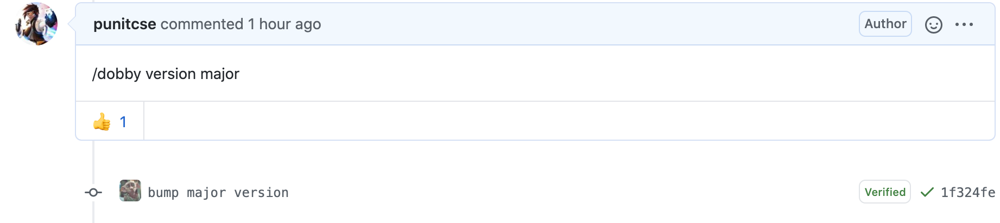

# Gem Version Update

A Github action for ruby gems that bumps the gem version in a pull request.

### Installation
1. Add a file to your github workflow `.github/workflows/version-update.yml` with following content:

```yaml

name: "version update action"
on:
  issue_comment:
    types: [created]
jobs:
  pr_commented:
    runs-on: ubuntu-latest
    steps:
      # TODO: remove this step after the action is public
      - name: action checkout
        uses: actions/checkout@v2
        with:
          repository: simplybusiness/version-update-action
          ref: refs/heads/master
          token: ${{ secrets.ACCESS_TOKEN }}
          path: ./
      - name: 'bump version' 
        uses: ./
        env:
          ACCESS_TOKEN: ${{ secrets.GITHUB_TOKEN }}
          # Change to the file path where you keep the Gem's version.
          # It is usually `lib/<gem name>/version.rb` or in the gemspec file.
          VERSION_FILE_PATH: <VERSION FILE PATH>
```

2. Add the following comment in the pull request to bump the version.

```
/version-update <semver level>
```
where semver level can be minor/major/patch.

3. Bot will add a commit to update version.
   

